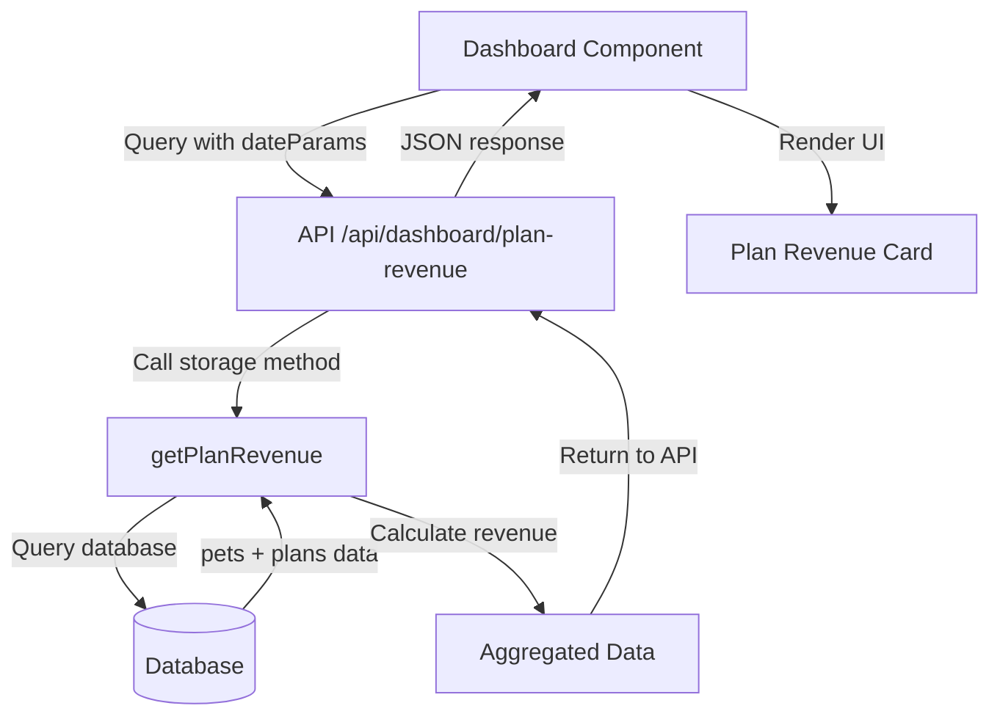
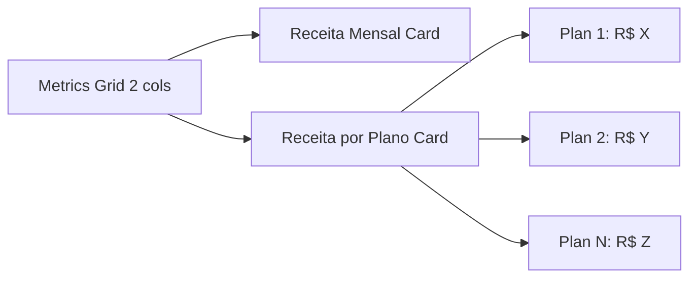

# Design: Seção "Receita por Plano" no Dashboard

## Overview

Este documento descreve a implementação de uma nova seção "Receita por Plano" no Dashboard da aplicação Sistema UNIPET. A seção será posicionada ao lado da seção "Receita Mensal" existente e mostrará o valor em reais que cada plano gerou como receita.

## Arquitetura

### Componente Afetado
- **Dashboard.tsx**: Página principal do dashboard onde será adicionada a nova seção

### Estrutura de Layout
```
Métricas Grid (2 colunas)
├── Receita Mensal (existente)
└── Receita por Plano (nova)
```

## Análise de Dados

### Fonte de Dados Atual
A aplicação já possui:
- **Tabela `pets`**: Contém associações entre pets e planos (`planId`)
- **Tabela `plans`**: Contém informações dos planos incluindo preço (`price` em centavos)
- **Tabela `guides`**: Contém guias de atendimento com valores (`value` em decimais)

### Cálculo de Receita por Plano
A receita de cada plano será calculada com base em:
1. **Pets ativos com planos**: Pets que possuem `planId` associado
2. **Preço do plano**: Valor mensal definido na tabela `plans.price`
3. **Filtro de data**: Aplicar filtros de data consistentes com outras métricas

## Implementação Backend

### Nova Função no Storage
```typescript
async getPlanRevenue(startDate?: string, endDate?: string): Promise<{
  planId: string;
  planName: string;
  petCount: number;
  monthlyPrice: number;
  totalRevenue: number;
}[]>
```

### Lógica de Cálculo
1. Buscar pets ativos com planos no período especificado
2. Agrupar por `planId`
3. Contar pets por plano
4. Multiplicar quantidade de pets pelo preço mensal do plano
5. Retornar dados agregados

### Nova Rota API
- **Endpoint**: `GET /api/dashboard/plan-revenue`
- **Parâmetros**: `startDate`, `endDate` (opcionais)
- **Resposta**: Array com receita por plano

## Implementação Frontend

### Estrutura do Componente
```typescript
// Query para buscar dados
const { data: planRevenue = [], isLoading: revenueLoading } = useQuery({
  queryKey: ["/api/dashboard/plan-revenue", dateParams],
  queryFn: async () => {
    const params = new URLSearchParams(dateParams);
    const response = await fetch(`/api/dashboard/plan-revenue?${params}`);
    return response.json();
  },
});
```

### Layout da Seção
```jsx
<Card>
  <CardContent className="p-6">
    <div className="flex items-start justify-between gap-2">
      <div className="flex-1 min-w-0">
        <p className="text-xs sm:text-sm text-muted-foreground">Receita por Plano</p>
        {revenueLoading ? (
          <Skeleton className="h-6 sm:h-8 w-full mt-1" />
        ) : (
          <div className="space-y-2 mt-2">
            {planRevenue.map(plan => (
              <div key={plan.planId} className="flex justify-between items-center">
                <span className="text-sm font-medium">{plan.planName}</span>
                <span className="text-sm font-bold text-primary">
                  R$ {plan.totalRevenue.toLocaleString('pt-BR', {
                    minimumFractionDigits: 2,
                    maximumFractionDigits: 2
                  })}
                </span>
              </div>
            ))}
          </div>
        )}
      </div>
      <TrendingUp className="h-6 w-6 sm:h-8 sm:w-8 text-primary flex-shrink-0" />
    </div>
  </CardContent>
</Card>
```

### Estados de Loading e Erro
- **Loading**: Skeleton placeholder durante carregamento
- **Erro**: Alert de erro consistente com outras seções
- **Vazio**: Mensagem informativa quando não há dados

### Integração com Filtros de Data
- Utilizar o mesmo sistema de filtros de data existente (`debouncedDateFilter`)
- Aplicar mesma lógica de debounce para performance
- Sincronizar com outras métricas do dashboard

## Especificações Técnicas

### Responsividade
- **Grid Layout**: Manter `lg:grid-cols-2` para 2 colunas em telas grandes
- **Mobile**: Empilhamento vertical em telas pequenas
- **Texto**: Tamanhos responsivos (`text-xs sm:text-sm`)

### Formatação de Valores
- **Moeda**: Formato brasileiro (R$ 1.234,56)
- **Precisão**: 2 casas decimais
- **Separadores**: Ponto para milhares, vírgula para decimais

### Performance
- **Query Caching**: Mesma estratégia das outras queries
- **Debounce**: 500ms para filtros de data
- **Memoização**: Evitar recálculos desnecessários

## Diagramas

### Fluxo de Dados


### Estrutura do Layout


## Considerações de Implementação

### Tratamento de Dados
1. **Planos sem pets**: Exibir com receita R$ 0,00
2. **Pets sem planos**: Ignorar no cálculo
3. **Planos inativos**: Incluir apenas se têm pets associados

### Validação
- Verificar se o preço do plano está definido
- Tratar valores nulos ou vazios
- Garantir consistência com outras métricas

### Compatibilidade
- Manter compatibilidade com filtros de data existentes
- Integrar com sistema de loading states
- Seguir padrões de UI estabelecidos no projeto

### Casos Especiais
- **Sem filtro de data**: Usar mês atual como padrão
- **Período sem dados**: Exibir mensagem apropriada
- **Erro na API**: Fallback para estado de erro

## Cenários de Teste

### Cenário 1: Dashboard com Dados
- **Given**: Existem pets com planos ativos
- **When**: Usuário visualiza o dashboard
- **Then**: Receita por plano é exibida corretamente

### Cenário 2: Filtro de Data
- **Given**: Usuário seleciona período específico
- **When**: Filtro é aplicado
- **Then**: Receita é recalculada para o período

### Cenário 3: Sem Dados
- **Given**: Não existem pets com planos
- **When**: Dashboard carrega
- **Then**: Seção exibe valores zerados

### Cenário 4: Estado de Loading
- **Given**: API está processando
- **When**: Componente está carregando
- **Then**: Skeleton é exibido

## Integração com Memórias do Projeto

### Layout Responsivo
Seguir especificação da memória sobre largura responsiva de componentes, garantindo que a nova seção mantenha consistência visual com o restante do dashboard.

### Dashboard Layout
Integrar com a configuração existente do layout do dashboard (`lg:grid-cols-4` reduzido para `lg:grid-cols-2` na seção de métricas), mantendo a organização visual estabelecida.