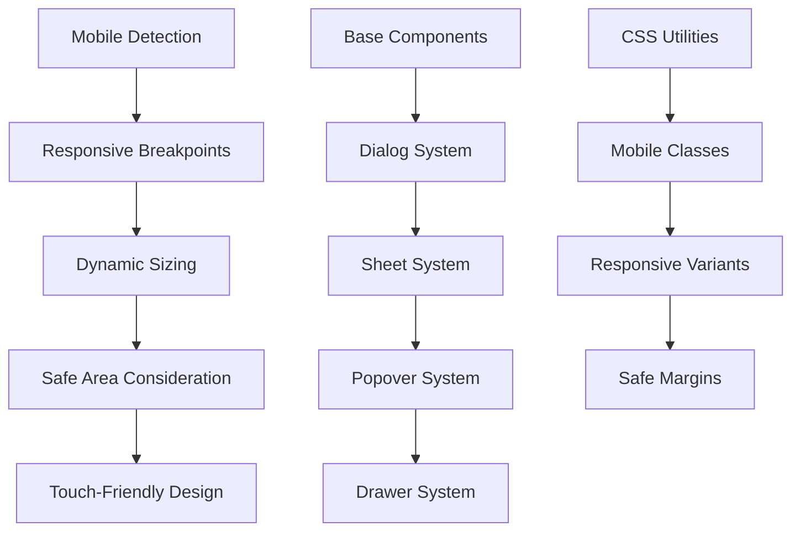
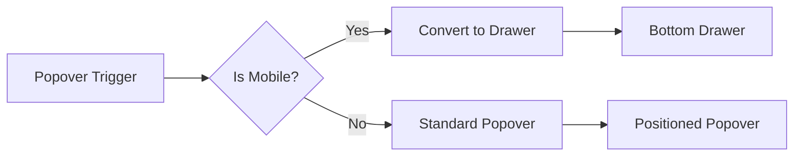

# Design: Melhorias na Responsividade de Popups para Mobile

## Overview

O projeto Sistema UNIPET apresenta problemas de usabilidade nos popups/modals em dispositivos móveis, onde ficam muito altos e colados às bordas da tela. Este design técnico propõe soluções abrangentes para otimizar a experiência mobile em todos os componentes de popup do sistema.

## Tecnologias Envolvidas

- **Frontend**: React + TypeScript
- **Styling**: Tailwind CSS
- **UI Library**: Radix UI + shadcn/ui
- **Build Tool**: Vite
- **Responsive Design**: Mobile-first approach

## Problemas Identificados

### Análise dos Componentes Afetados

| Componente | Arquivo | Problemas Mobile |
|------------|---------|------------------|
| Dialog | `dialog.tsx` | Margem insuficiente, altura excessiva |
| ConfirmDialog | `confirm-dialog.tsx` | Posicionamento inadequado |
| PasswordDialog | `password-dialog.tsx` | Largura e padding não otimizados |
| Sheet | `sheet.tsx` | Largura fixa problemática |
| Popover | `popover.tsx` | Sem responsividade específica |
| Drawer | `drawer.tsx` | Altura não controlada |
| CommandDialog | `command.tsx` | Padding e overflow inadequados |

### Problemas Específicos

1. **Margens Insuficientes**: Popups ficam colados às bordas
2. **Altura Excessiva**: Ocupam quase toda a viewport
3. **Largura Inadequada**: Não consideram larguras mínimas mobile
4. **Padding Inconsistente**: Espaçamento interno inadequado
5. **Scroll Problems**: Conteúdo longo sem scroll apropriado
6. **Z-index Issues**: Sobreposição com elementos fixos

## Arquitetura da Solução

### Estratégia Mobile-First



### Componentes Principais

#### 1. Enhanced Dialog System
- **Mobile Viewport Detection**: Detecção automática de dispositivos móveis
- **Dynamic Sizing**: Largura e altura adaptáveis
- **Safe Areas**: Margens de segurança para evitar bordas coladas
- **Scroll Management**: Controle de overflow e scroll interno

#### 2. Responsive Sheet Components
- **Adaptive Width**: Largura responsiva baseada no viewport
- **Height Control**: Controle de altura máxima
- **Touch Gestures**: Suporte a gestos de swipe

#### 3. Mobile-Optimized Popover
- **Viewport Awareness**: Posicionamento inteligente
- **Collision Detection**: Prevenção de cortes na tela
- **Fallback Strategy**: Conversão para drawer em telas pequenas

## Design System Melhorado

### Breakpoints e Dimensões

| Breakpoint | Largura | Comportamento |
|------------|---------|---------------|
| xs (≤320px) | 100% - 1rem | Margens mínimas |
| sm (≤640px) | 100% - 2rem | Margens confortáveis |
| md (≤768px) | 90% max | Centralizado |
| lg+ (>768px) | Comportamento desktop | Tamanhos fixos |

### Classes CSS Mobile-Optimized

```css
/* Mobile Dialog Classes */
.dialog-mobile {
  width: calc(100vw - 2rem);
  max-height: calc(100vh - 4rem);
  margin: 1rem;
}

.dialog-safe-area {
  padding: env(safe-area-inset-top) env(safe-area-inset-right) 
           env(safe-area-inset-bottom) env(safe-area-inset-left);
}

/* Sheet Mobile Classes */
.sheet-mobile {
  width: min(90vw, 28rem);
  max-height: 85vh;
}

/* Popover Mobile Classes */
.popover-mobile {
  width: calc(100vw - 1rem);
  max-width: 20rem;
}
```

### Responsive Component Pattern

```typescript
interface MobileOptimizedProps {
  isMobile?: boolean;
  viewport?: 'mobile' | 'tablet' | 'desktop';
  safeArea?: boolean;
  maxHeight?: string;
  mobileFullscreen?: boolean;
}
```

## Implementação por Componente

### Dialog Component Enhancements

#### Características Mobile
- **Margens Seguras**: `mx-4 my-4` para evitar bordas coladas
- **Altura Controlada**: `max-h-[calc(100vh-2rem)]` 
- **Largura Responsiva**: `w-[calc(100vw-2rem)]` em mobile
- **Scroll Interno**: `overflow-y-auto` para conteúdo longo
- **Safe Area Support**: Suporte a notch e áreas seguras

#### Configuração de Classes
```css
/* Mobile */
"w-[calc(100vw-2rem)] max-h-[calc(100vh-2rem)] mx-4 my-4"

/* Tablet */
"sm:max-w-lg sm:mx-auto"

/* Desktop */
"md:max-w-xl lg:max-w-2xl"
```

### Sheet Component Optimizations

#### Mobile Behavior
- **Adaptive Width**: `w-[90vw]` em mobile, `sm:max-w-sm` em desktop
- **Height Constraints**: `max-h-[85vh]` para evitar altura excessiva
- **Touch-Friendly**: Área de arraste ampliada
- **Gesture Support**: Suporte nativo a swipe gestures

### Popover Mobile Strategy

#### Fallback System


#### Mobile Transformation
- **Auto-conversion**: Popovers se tornam drawers em mobile
- **Bottom Positioning**: Drawer emerge do bottom
- **Full Width**: Utiliza toda largura disponível
- **Gesture Close**: Swipe down para fechar

### Enhanced Mobile Utilities

#### Viewport Detection Hook
```typescript
const useMobileViewport = () => {
  const [isMobile, setIsMobile] = useState(false);
  const [viewport, setViewport] = useState<'mobile' | 'tablet' | 'desktop'>('desktop');
  
  // Logic for viewport detection
  return { isMobile, viewport };
};
```

#### Safe Area Hook
```typescript
const useSafeArea = () => {
  const [safeArea, setSafeArea] = useState({
    top: 0, right: 0, bottom: 0, left: 0
  });
  
  // CSS env() variables integration
  return safeArea;
};
```

## Performance e Acessibilidade

### Performance Optimizations
- **Lazy Loading**: Componentes popup carregados sob demanda
- **Virtual Scrolling**: Para listas longas em popups
- **Animation Throttling**: Animações otimizadas para mobile

### Acessibilidade Mobile
- **Touch Targets**: Mínimo 44px para elementos interativos
- **Focus Management**: Gerenciamento de foco em telas touch
- **Screen Reader**: Suporte aprimorado para leitores de tela
- **High Contrast**: Suporte a modo de alto contraste

## Layout Responsive Grid

### Mobile Layout Strategy
```css
/* Mobile-first Grid */
.popup-grid {
  display: grid;
  grid-template-rows: auto 1fr auto;
  max-height: calc(100vh - 4rem);
}

.popup-header {
  padding: 1rem;
  border-bottom: 1px solid var(--border);
}

.popup-content {
  padding: 1rem;
  overflow-y: auto;
  flex: 1;
}

.popup-footer {
  padding: 1rem;
  border-top: 1px solid var(--border);
}
```

### Responsive Button Layout
```css
/* Mobile: Stack buttons vertically */
.button-group-mobile {
  @apply flex flex-col-reverse gap-2;
}

/* Desktop: Horizontal layout */
.button-group-desktop {
  @apply sm:flex-row sm:justify-end sm:space-x-2;
}
```

## Testes de Responsividade

### Device Testing Matrix

| Device Type | Viewport | Test Scenarios |
|-------------|----------|----------------|
| iPhone SE | 375x667 | Popup positioning, margins |
| iPhone 12 | 390x844 | Safe area, notch handling |
| iPad | 768x1024 | Tablet behavior |
| Galaxy S21 | 360x800 | Android navigation |
| Pixel 6 | 412x915 | Large mobile screens |

### Test Cases
1. **Dialog Opening**: Verifica margens e posicionamento
2. **Content Overflow**: Testa scroll interno
3. **Landscape Mode**: Comportamento em paisagem
4. **Keyboard Interaction**: Popup com teclado virtual
5. **Touch Gestures**: Swipe para fechar
6. **Safe Area**: Dispositivos com notch

## Migration Strategy

### Fase 1: Core Components
1. Atualizar `dialog.tsx` com classes mobile-first
2. Implementar `useMobileViewport` hook
3. Adicionar utilitários CSS mobile

### Fase 2: Specialized Popups
1. Atualizar `confirm-dialog.tsx` e `password-dialog.tsx`
2. Implementar auto-conversion popover→drawer
3. Otimizar `sheet.tsx` para mobile

### Fase 3: Advanced Features
1. Implementar safe area support
2. Adicionar gesture recognition
3. Performance optimizations

### Fase 4: Testing & Polish
1. Testes em dispositivos reais
2. Ajustes de acessibilidade
3. Performance monitoring